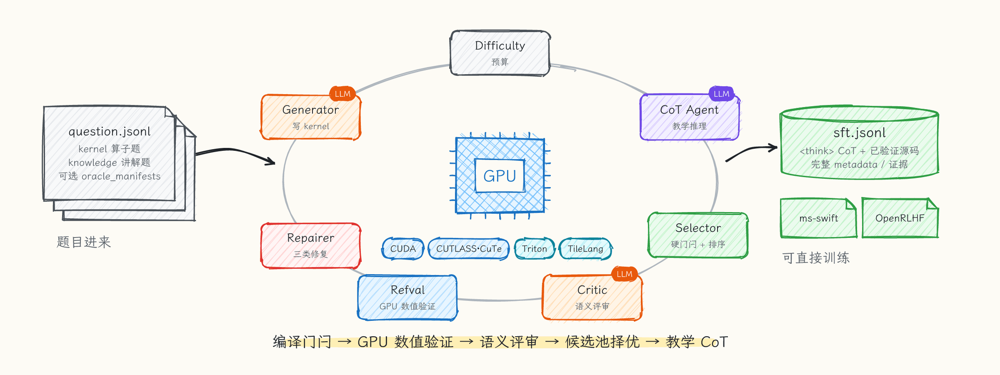
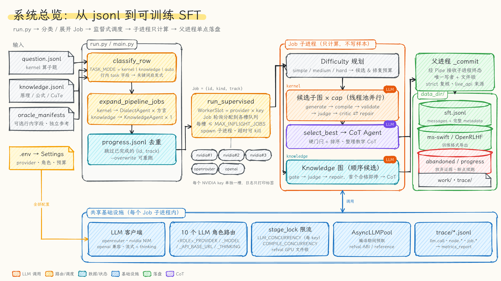
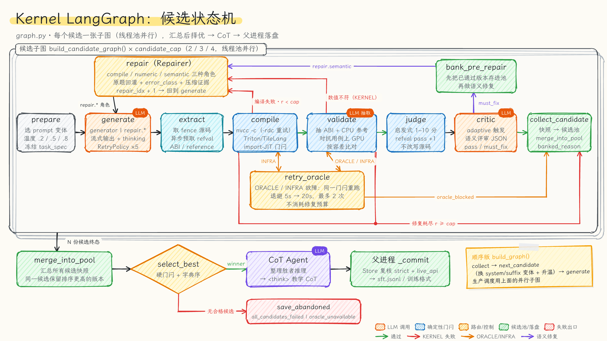
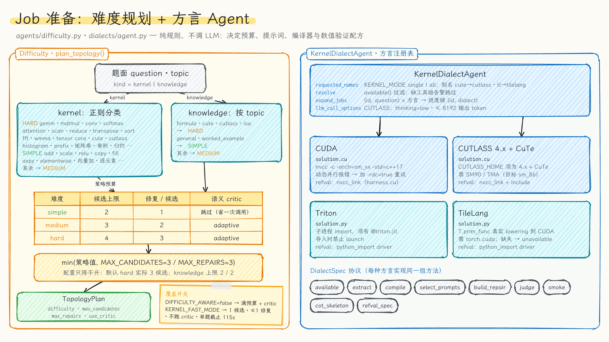
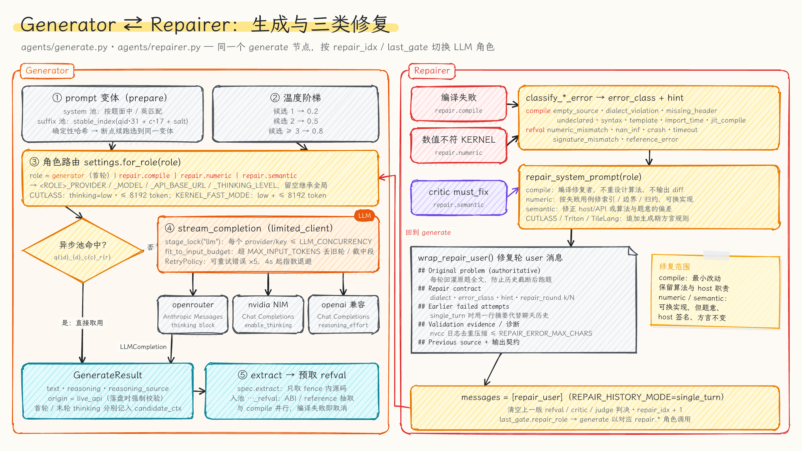
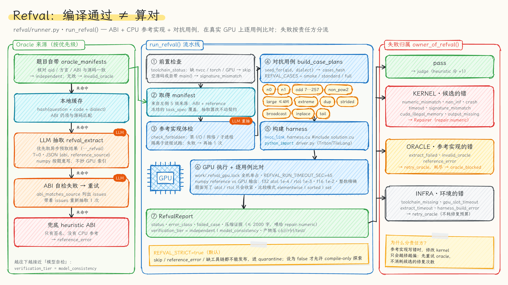
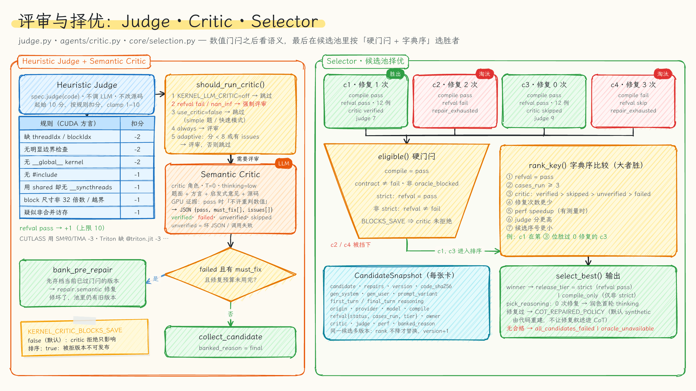
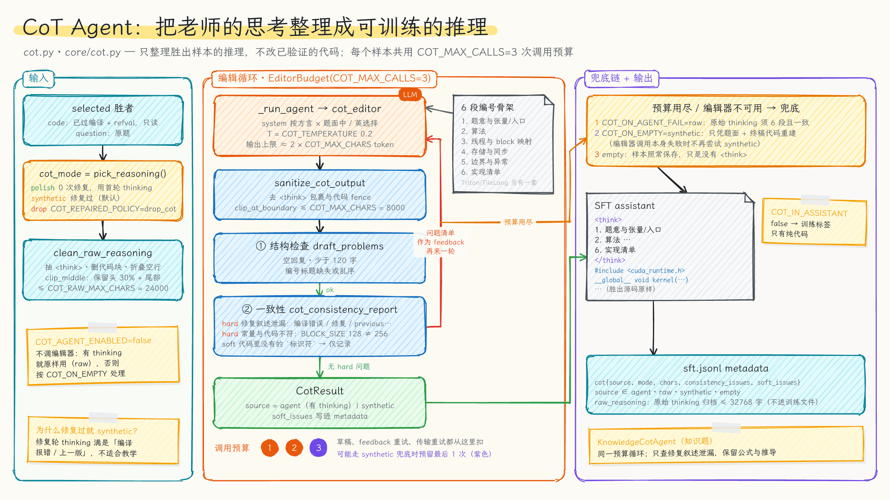
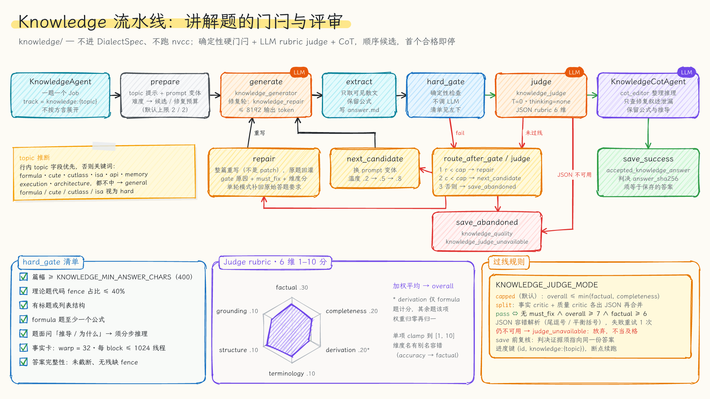
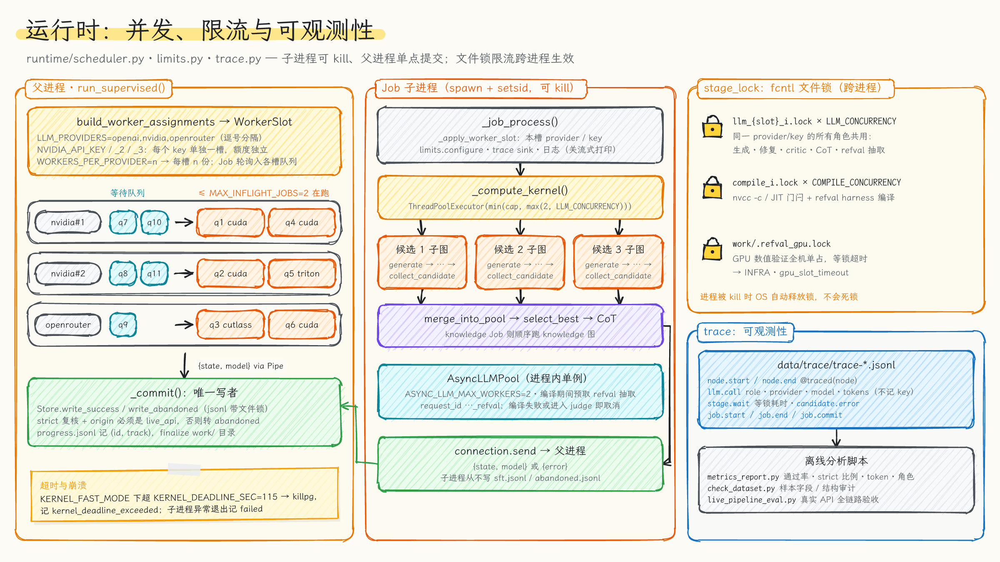

# CUDA 算子 SFT 数据生成



用大模型（NVIDIA NIM / OpenRouter / OpenAI 兼容接口）为 `question.jsonl` 里的题目写 GPU 算子，**先编译、再上真实 GPU 做数值验证、再做语义评审**，从多个候选中择优，最后把老师模型的思考整理成教学型 CoT，输出可直接用于 ms-swift / OpenRLHF 的 SFT 数据。整条流水线用 LangGraph 编排，支持 CUDA、CUTLASS 4.x + CuTe、Triton、TileLang 四种方言，以及一条独立的知识讲解题流水线。

**核心设计**

- **双硬门闩**：`nvcc -c`（或 Triton / TileLang 的 import-JIT）只是第一道门；随后用 ABI + CPU 参考实现 + 对抗用例在 GPU 上逐元素比对（refval）。默认 `REFVAL_STRICT=true`，没有数值证据的样本不会进入训练文件。
- **候选池择优**：按难度生成 2 / 3 / 4 个候选，每个候选有 1 / 2 / 3 次修复机会；全部收集后按「硬门闩 + 字典序」选胜者，而不是第一个通过就返回。
- **失败按责任方分流**：编译或数值失败先判定是 kernel、参考实现（oracle）还是环境（infra）的问题。只有 kernel 的错才消耗修复预算；oracle / infra 问题走退避重试。
- **每个 LLM 角色独立路由**：生成、三类修复、评审、CoT 编辑、refval 抽取、知识题生成 / 修复 / 评审共 10 个角色，可分别指定 provider、模型、端点和思考档位。
- **干净的训练标签**：训练 `user` 默认就是原题；CoT 只整理胜出样本的推理，修复过程中的「编译报错 / 上一版」等叙述不会进入训练数据。

> 题面里提到的 `include/solution_header.h` 在本仓库并不存在，编译时使用空 stub。没有提供 `oracle_manifests` 时，host ABI 和参考实现由 LLM 从题面和候选源码抽取，属于**模型自检**（`verification_tier=model_consistency`）；题目自带独立 oracle 时按固定 ABI 和参考实现验证（`independent`）。

## 目录

- [架构总览](#架构总览)
- [Agent 结构图](#agent-结构图)
- [快速开始](#快速开始)
- [配置参考](#配置参考)
- [输出与训练格式](#输出与训练格式)
- [知识题（架构 / CuTe 理论 / 公式）](#知识题架构--cute-理论--公式)
- [验证与评测](#验证与评测)
- [项目结构](#项目结构)

## 架构总览



1. **入口**：`run.py`（等价于 `python -m cuda_sft`）读取题目和 `.env`，`classify_row` 按 `TASK_MODE` 把每行分到 kernel 或 knowledge；`expand_pipeline_jobs` 把 kernel 题按方言展开，knowledge 题每题一个 Job；`progress.jsonl` 里已完成的 `(id, track)` 会被跳过。
2. **调度**：`run_supervised` 为每个 provider / key 建一个 WorkerSlot，Job 轮询进各槽队列，每槽同时最多跑 `MAX_INFLIGHT_JOBS` 个子进程。
3. **计算**：子进程只计算、不写样本。kernel Job 用线程池并行跑多个候选子图，汇总后择优并整理 CoT；knowledge Job 顺序尝试候选，首个合格即停。
4. **落盘**：终态经 Pipe 回到父进程，由 `_commit` 作为唯一写者再次复核 strict 门闩与 `live_api` 来源后写入 `data_dir/`。

### Agent 职责一览

| Agent | 代码 | LLM 角色 | 输入 → 产出 |
|---|---|---|---|
| Difficulty 规划 | `agents/difficulty.py` | — | 题面 / topic → 候选、修复预算与 critic 开关 |
| KernelDialectAgent | `dialects/` | — | 方言配置 → prompt、编译门闩、refval 配方 |
| Generator | `agents/generate.py` | `generator` | 原题 + 方言 prompt → 源码 + thinking |
| Repairer | `agents/repairer.py` | `repair.compile` · `repair.numeric` · `repair.semantic` | 失败诊断 + 原题 → 完整重写的源码 |
| Refval 抽取 / 执行 | `refval/` | `refval_extract` | 源码 + 题面或输入 oracle → ABI、CPU 参考、GPU 数值证据 |
| Heuristic Judge | `judge.py`、各方言 `judge()` | — | 源码 → 1–10 分与 issues（不改写代码） |
| Semantic Critic | `agents/critic.py` | `critic` | 题面 + 源码 + GPU 证据 → `pass` / `must_fix` |
| Selector | `core/selection.py` | — | 候选池 → 胜者或放弃原因 |
| CoT Agent | `cot.py`、`core/cot.py` | `cot_editor` | 胜者 + 老师 thinking → 教学 CoT |
| Knowledge 流水线 | `knowledge/` | `knowledge_generator` · `knowledge_repair` · `knowledge_judge` · `cot_editor` | 讲解题 → 通过 rubric 的散文答案 |

`data/trace/` 中的 `llm.call`、`node.*`、`job.*` 事件记录每次调用的角色、provider、模型、token 与最终状态（不记录 key），用于核对各角色确实参与了协作。

## Agent 结构图

### 1. Kernel LangGraph：候选状态机



- 每个候选是一张独立子图（`build_candidate_graph()`）：`prepare → generate → extract → compile → validate → judge → critic → collect_candidate`，候选之间在线程池里并行。
- **编译失败**且还有修复预算 → `repair`；**数值不符**（kernel 的错）→ `repair.numeric`；**critic 给出 must_fix** → 先 `bank_pre_repair` 把已通过的版本存进池，再做语义修复。
- **ORACLE / INFRA 故障**（参考实现抽取失败、缺工具链、GPU 锁超时等）→ `retry_oracle` 按 5s / 20s 退避重跑同一门闩，最多 `ORACLE_RETRY_MAX=2` 次，不消耗修复预算；仍失败则标记 `oracle_blocked`。
- 所有候选结束后 `merge_into_pool → select_best → CoT Agent`，由父进程提交。顺序版 `build_graph()` 在 `collect_candidate` 后用 `next_candidate` 换 prompt 变体并升温（0.2 → 0.5 → 0.8）。

### 2. Job 准备：难度规划 + 方言 Agent



- **难度**纯规则判断：kernel 题按正则（gemm / softmax / scan / 归约 … 为 hard，add / scale / 逐元素 … 为 simple），knowledge 题按 topic。simple / medium / hard 对应 2 / 3 / 4 个候选、1 / 2 / 3 次修复；simple 题跳过语义 critic。
- 策略值再与 `MAX_CANDIDATES` / `MAX_REPAIRS` 取最小值——配置只会降低开销。默认 `MAX_CANDIDATES=3`，所以 hard 题实际是 3 个候选。
- **KernelDialectAgent** 管理四种方言：别名归一（`cute → cutlass`、`tl → tilelang`）、用 `available()` 过滤缺工具链的方言、按 `(id, 方言)` 展开 Job；每种方言实现同一个 `DialectSpec` 协议（提示词、源码抽取、编译门闩、修复模板、启发式 judge、CoT 骨架、refval 配方）。

### 3. Generator ⇄ Repairer



- **Generator**：system / suffix 变体由确定性哈希选择（断点续跑会选到同一变体），题面含中文时匹配中文 prompt；`settings.for_role(role)` 解析该角色的 provider、模型、端点与思考档位；所有调用经 `limited_client` 受 `LLM_CONCURRENCY` 限流，可重试错误由 LangGraph RetryPolicy 指数退避重试。
- `extract` 取出源码后，立即把 refval 的 ABI / 参考实现抽取请求放进异步池，与编译并行。
- **Repairer**：把编译日志或 refval 证据归类为 `error_class`（每类附一行可执行 hint），按角色选择 system prompt；修复轮 user 消息始终**回灌原题全文**，并附修复契约、之前失败轮次的摘要和上一版源码。编译修复要求最小改动；数值 / 语义修复可以换实现，但题意、host 签名和方言不能变。

### 4. Refval：编译通过 ≠ 算对



- **Oracle 来源**按优先级：题目自带 `oracle_manifests`（核对题号、方言和 ABI，产出 `independent` 证据）→ 本地缓存 → LLM 抽取（优先用异步预取结果，`T=0` 输出 JSON）→ ABI 自检失败带 issues 重抽一次 → 兜底启发式 ABI（没有 CPU 参考，记 `reference_error`）。
- 参考实现先过静态检查（禁 I/O、网络、子进程），再在隔离子进程里试跑；对抗用例覆盖 `n0`、`n1`、非整 tile、非 2 幂、large、extreme、dup、strided、broadcast、inplace、tail 等，由 `seed_for(qid, dialect)` 确定并记录 `cases_hash`。
- CUDA / CUTLASS 生成 `harness.cu`（`#include "solution.cu"` + `main`）链接执行；Triton / TileLang 由 `driver.py` 导入入口、launch 并同步。GPU 执行受 `work/.refval_gpu.lock` 全机互斥。
- 结果按责任方分流：KERNEL → `repair.numeric`；ORACLE / INFRA → `retry_oracle`。

### 5. 评审与择优：Judge · Critic · Selector



- **Heuristic Judge** 从 10 分起按规则扣分（缺线程索引、无边界检查、shared memory 无同步等），refval 通过再加 1 分；它只提供信号，不证明正确，也不改写源码。
- **Semantic Critic**（`KERNEL_LLM_CRITIC=adaptive`）在分数 < 8 或有 issues 时触发；refval 失败时强制评审。refval 已通过时，prompt 明确要求它不要重判数值，只看 host/API、算法与方言是否符合题意。
- **Selector** 先用 `eligible()` 硬门闩过滤（编译通过、非 `oracle_blocked`，strict 模式下 refval 必须 pass），再按 `rank_key()` 字典序比较：refval pass → 用例数 ≥ 3 → critic 状态 → 修复次数少 → 性能 → judge 分 → 候选序号。

### 6. CoT Agent



- 0 次修复的胜者润色首轮 thinking；修复过的胜者默认（`COT_REPAIRED_POLICY=synthetic`）只凭题面和终稿代码重建推理，避免修复叙述进入训练数据。
- 编辑器按方言和题面语言给出 6 段编号骨架；每份草稿先做结构检查（长度、编号标题），再做一致性检查：出现修复叙述或与代码不符的常量（如 `BLOCK_SIZE`）会带着问题清单重试。
- 草稿、重试和兜底共用 `COT_MAX_CALLS=3` 次调用预算；失败时依次回退到结构合格的原始 thinking（`raw`）→ 合成（`synthetic`）→ 空 CoT（样本照常保存，只是没有 `<think>`）。

### 7. Knowledge 流水线



- 独立于方言体系，不跑 `nvcc`：`generate → extract → hard_gate → judge → CoT`，候选顺序尝试，首个合格即停，以控制 API 成本。
- 硬门闩不调 LLM：篇幅、代码占比、结构、公式、推导步骤和事实卡（warp = 32、每 block ≤ 1024 线程）。
- LLM Judge 按 6 个维度加权打分；默认 `capped` 模式下 overall 不超过 factual 与 completeness 的最小值，任何 `must_fix` 一票否决。JSON 无法解析时记 `judge_unavailable` 并放弃该题，不把坏 JSON 当作及格。

### 8. 运行时：并发、限流与可观测性



- 子进程以 `spawn + setsid` 启动，快速模式下超过 `KERNEL_DEADLINE_SEC` 会被整组 kill；只有父进程写样本。
- `stage_lock` 基于 `fcntl` 文件锁跨进程生效：同一 provider / key 的所有角色共享 `LLM_CONCURRENCY`，编译门闩与 harness 编译共享 `COMPILE_CONCURRENCY`；进程被 kill 时锁由操作系统自动释放。
- 所有节点由 `@traced` 记录，配合 `scripts/metrics_report.py` 统计通过率、strict 比例、token 与角色分布。

## 快速开始

### 1. 安装

推荐使用 conda 环境 `langchain`（已包含 langgraph）。

```bash
conda activate langchain
cp .env.example .env                  # 若还没有 .env
python -m pip install -e .            # 核心依赖
python -m pip install -e '.[dev]'     # 开发与测试依赖（可选）
```

检测四种方言的运行环境，缺什么就自动安装：

```bash
bash scripts/setup_env.sh                            # 检测 + 安装
bash scripts/setup_env.sh --check                    # 只检测，不安装、不改 .env
bash scripts/setup_env.sh --dialects cuda,cutlass,triton
```

等价入口：`python scripts/setup_env.py`、`python run.py --setup`。脚本会按需：

1. `pip install -e .`（核心依赖缺失时，读取 `pyproject.toml`）；
2. 安装 `triton`（缺 torch 时一并安装）和 `tilelang`；
3. 没有 CUTLASS 4.x 时 `git clone` 到 `third_party/cutlass` 并写入 `CUTLASS_HOME`；
4. 没有 `nvcc` 时尝试 conda（`nvidia` 频道的 `cuda-nvcc`）或 pip 的 `cuda-toolkit` / NVIDIA wheels；
5. 没有 `g++` 时尝试 conda-forge 的 `cxx-compiler`；
6. 对各方言做一次 smoke compile（`--no-smoke` 跳过）。

也可以只装某个方言的依赖：`pip install -e '.[triton]'` 或 `pip install -e '.[tilelang]'`。

> - TileLang 使用 `tilelang==0.1.14`（兼容的较新版本也可）。检查会同时验证 `apache-tvm-ffi`、`torch-c-dlpack-ext`、`z3-solver` 等传递依赖和 Torch CUDA 设备，并把 canonical `T.prim_func` 真实 lowering 到 CUDA；仅能 import 不算通过。不可用时标记为 `unavailable`，严格流程会把样本留在 quarantine，不伪造 pass。
> - 脚本**不会**安装 GPU 驱动；没有 `nvidia-smi` 时 Triton JIT 可能不可用。conda / pip 装不上 `nvcc` 时请自行安装 CUDA Toolkit。
> - 本机默认会探测到 RTX 3060 / `sm_86` / CUDA 12.6。

### 2. 配置 `.env`

填入所用 provider 的 key。最小配置示例：

```bash
# NVIDIA NIM：最多 3 个 key，每个 key 是一个独立的 worker 槽位
LLM_PROVIDER=nvidia
NVIDIA_API_KEY=nvapi-...
NVIDIA_API_KEY_2=nvapi-...
NVIDIA_API_KEY_3=nvapi-...
MODEL=nvidia/nemotron-3-ultra-550b-a55b
THINKING_LEVEL=medium
```

```bash
# OpenAI 兼容接口（默认端点 https://www.poke2api.com/v1）
LLM_PROVIDER=openai
LLM_PROVIDERS=openai
OPENAI_API_KEY=
OPENAI_MODEL=gpt-6-luna
MODEL=
```

`.env.example` 列出了全部 10 个 LLM 角色：`GENERATOR`、`REPAIR_COMPILE`、`REPAIR_NUMERIC`、`REPAIR_SEMANTIC`、`CRITIC`、`COT_EDITOR`、`REFVAL_EXTRACT`、`KNOWLEDGE_GENERATOR`、`KNOWLEDGE_REPAIR`、`KNOWLEDGE_JUDGE`。每个角色都可以设置 `<角色>_PROVIDER`、`<角色>_MODEL`、`<角色>_API_BASE_URL`；例如让评审单独走 OpenRouter：`CRITIC_PROVIDER=openrouter`、`CRITIC_MODEL=...`。留空的项沿用 worker 分配的 provider、`MODEL`（或 provider 专属模型）和默认端点，因此多 provider worker 模式仍然有效。

`GENERATOR`、`REPAIR_COMPILE`、`COT_EDITOR`、`REFVAL_EXTRACT`、`KNOWLEDGE_GENERATOR` 另有 `*_THINKING_LEVEL`：留空继承 `THINKING_LEVEL`（知识角色继承 `KNOWLEDGE_THINKING_LEVEL`），设为 `none` 可关闭思考。生成和编译修复的显式角色档位优先于快速模式及 CUTLASS 的 `low` 默认值，但这些模式的输出 token 上限仍然生效。

三个 NVIDIA key 用来提高 NIM 并发（额度按 key 独立计算）。配合 `LLM_PROVIDERS=nvidia,openrouter` 和 `WORKERS_PER_PROVIDER=1`，会启动 3 个 nvidia worker（每 key 一个）+ 1 个 openrouter worker；日志只打印 `nvidia#1` / `nvidia#2` / `nvidia#3`，不会写出 key。

### 3. 运行

```bash
python run.py --dry-compile        # 先确认 nvcc 可用
python run.py --limit 3            # 试跑 3 题
python run.py                      # 全量；自动跳过 progress.jsonl 里已成功或已放弃的题
conda run -n langchain python run.py --limit 3   # 不手动 activate
```

多进程（jsonl 写入带文件锁；worker > 1 时关闭 token 流式打印）：

```bash
python run.py --workers 6 --quiet
python run.py --workers 6 --limit 12 --quiet     # 并发试跑
```

多方言：

```bash
python run.py --dialects cutlass --limit 3                                  # 只写 CUTLASS 4.x / CuTe
python run.py --dialects cuda,cutlass,triton,tilelang --kernel-mode all --limit 3   # 每题四种方言各一遍
```

`KERNEL_MODE=all` 时 CLI 层按方言展开 Job，进度键是 `(id, dialect)`；TileLang 工具链不可用时会记录证据并跳过。

常用参数：`--offset N`、`--ids 1,2,10`、`--overwrite`、`--quiet`、`--workers N`、`--providers openai,nvidia`、`--workers-per-provider N`、`--data-dir DIR`、`--dialects ...`、`--kernel-mode all`、`--kernel-fast`、`--no-refval`、`--task kernel|knowledge|auto`、`--input FILE`。

**只做编译门闩**（探索用，不产出 strict 样本）：

```bash
REFVAL_ENABLED=false REFVAL_STRICT=false python run.py --limit 3
```

`REFVAL_STRICT=true` 会把 ABI / 参考实现抽取失败、缺少工具链和数值验证 skip 都视为不可发布：这些样本进入 quarantine / abandoned 记录，不会写进 `sft.jsonl`。只有显式设为 `false` 才允许 compile-only 样本，此时 `metadata.refval.status` 仍会保留 `skip` 或 `reference_error`。

**题目自带独立 oracle**：题目行可带 `oracle_manifests` 字段，键为方言名，值为该方言的 `RefManifest` JSON（包括匹配的 `question_id`、`dialect`、`abi` 和独立编写的 `reference_source`）；`KERNEL_MODE=all` 时须覆盖每个目标方言。有输入 oracle 时先核对题号、方言和源码 ABI，无效或缺项直接失败，不会悄悄改用模型参考实现。两种数值通过结果都可以写入主文件，`metadata.verification_tier` 分别为 `independent` 或 `model_consistency`，`metadata.oracle_origin` 记录来源。独立等级表示参考实现由题目输入提供，其可信度仍由输入方负责；`release_tier` 保持原含义，不能仅凭它推断存在独立语义证据。

## 配置参考

所有配置都可以写在 `.env` 或环境变量里（不区分大小写）。

<details>
<summary><b>Provider 与模型</b></summary>

| 变量 | 默认 | 含义 |
|---|---|---|
| `LLM_PROVIDER` | `openrouter` | `openrouter`（Anthropic Messages）、`nvidia`（NIM）或 `openai`（OpenAI 兼容 Chat Completions） |
| `LLM_PROVIDERS` | 空 | 逗号分隔的多 provider，如 `openai,nvidia,openrouter` |
| `OPENROUTER_API_KEY` | 空 | 默认端点 `https://openrouter.ai/api` |
| `NVIDIA_API_KEY` / `_2` / `_3` | 空 | 最多 3 个 key，每个 key 一个 worker 槽位；默认端点 `https://integrate.api.nvidia.com/v1` |
| `OPENAI_API_KEY` | 空 | 默认端点 `https://www.poke2api.com/v1` |
| `OPENROUTER_MODEL` | `nvidia/nemotron-3-ultra-550b-a55b:free` | OpenRouter 模型 |
| `NVIDIA_MODEL` | `nvidia/nemotron-3-ultra-550b-a55b` | NVIDIA 官方模型 |
| `OPENAI_MODEL` | `gpt-6-luna` | OpenAI 兼容接口模型 |
| `MODEL` | 空 | 非空时覆盖 provider 专属模型；角色模型优先于它 |
| `<角色>_PROVIDER` / `_MODEL` / `_API_BASE_URL` | 空 | 覆盖该角色的 provider、模型、端点；URL 可填根地址或以 `/v1` 结尾 |
| `THINKING_LEVEL` | `medium` | OpenRouter 走 `reasoning.effort`；NVIDIA 走 `chat_template_kwargs.enable_thinking`；OpenAI 兼容走 `reasoning_effort` |
| `MAX_INPUT_TOKENS` | `131072` | 输入上限；超出时丢弃旧轮次并截断（按字符估算 token） |
| `MAX_OUTPUT_TOKENS` | 未设则用 `MAX_TOKENS` | 输出 token 上限；OpenAI 兼容接口使用 `max_completion_tokens` |
| `MAX_TOKENS` | `50000` | 兼容别名 |
| `TOP_P` | `0.95` | NVIDIA Chat Completions 的 top_p |
| `LLM_TIMEOUT_SEC` | `600` | 单次调用超时 |

</details>

<details>
<summary><b>生成预算与并发</b></summary>

| 变量 | 默认 | 含义 |
|---|---|---|
| `MAX_CANDIDATES` | `3` | 每题候选上限；`DIFFICULTY_AWARE` 可能按难度进一步收紧 |
| `MAX_REPAIRS` | `3` | 每个候选的修复上限 |
| `DIFFICULTY_AWARE` | `true` | simple / medium / hard 为 2 / 3 / 4 个候选、1 / 2 / 3 次修复（仍受上面两项限制）；simple 题跳过 critic |
| `KERNEL_FAST_MODE` | `false` | `true` 时每题 1 个候选、≤ 1 次修复、低思考档位，跳过 critic 和 CoT 编辑；CLI 用 `--kernel-fast` |
| `KERNEL_DEADLINE_SEC` | `115` | 快速模式下的单题截止时间，到时记 `kernel_deadline_exceeded`，不保证截止前一定得到合格算子 |
| `WORKERS` | `1` | `WORKERS_PER_PROVIDER=0` 时的总 worker 数；nvidia worker 在多个 key 间轮询 |
| `WORKERS_PER_PROVIDER` | `0` | 每个槽位的 worker 数；例如 3 个 NVIDIA key + openrouter、值为 2 → 6 个 nvidia + 2 个 openrouter |
| `MAX_INFLIGHT_JOBS` | `2` | 每个 worker 槽位同时在跑的题目数 |
| `LLM_CONCURRENCY` | `2` | 同一 provider / key 的实时 API 调用上限（生成、修复、评审、CoT、抽取共用） |
| `COMPILE_CONCURRENCY` | `1` | 全局编译门闩与 refval harness 编译并发上限 |
| `ASYNC_LLM_ENABLED` | `true` | 编译期间异步预取 refval ABI / 参考实现抽取；修复依赖失败诊断，不做投机预取 |
| `ASYNC_LLM_MAX_WORKERS` | `2` | 预取池并发（1–4） |
| `REPAIR_HISTORY_MODE` | `single_turn` | `single_turn`：修复轮只发一条自包含消息（原题 + 契约 + 历史摘要）；`full`：重发完整对话 |
| `REPAIR_ERROR_MAX_CHARS` | `6000` | 修复轮编译日志上限；超出则去重摘要 |
| `WORK_KEEP` | `simple` | `simple`：`work/q{id}/` 只留最终源码；`detailed`：保留全部 `c*/r*` 尝试 |

</details>

<details>
<summary><b>方言</b></summary>

| 变量 | 默认 | 含义 |
|---|---|---|
| `KERNEL_DIALECTS` | `cuda` | 逗号分隔：`cuda`、`cutlass`（CUTLASS **4.x** + CuTe，别名 `cute`）、`triton`、`tilelang` |
| `KERNEL_MODE` | `single` | `single` 只跑一种；`all` 每题把列出的方言各生成一遍 |
| `KERNEL_DIALECT` | 空 | `single` 时覆盖列表第一项 |
| `CUTLASS_HOME` | `/usr/local/cutlass-4.3.5` | CUTLASS 4.x 根目录（须含 CuTe） |
| `CUTLASS_CXX_STD` | `c++17` | cutlass 方言的 `nvcc -std=` |
| `CUTLASS_THINKING_LEVEL` / `CUTLASS_MAX_OUTPUT_TOKENS` / `CUTLASS_REASONING_MAX_TOKENS` | `low` / `8192` / `2048` | CUTLASS 单独的更小思考预算 |
| `TRITON_TIMEOUT_SEC` | `90` | Triton import / JIT 门闩超时 |
| `TILELANG_TIMEOUT_SEC` | `180` | TileLang 门闩超时；未安装则自动跳过 |
| `CUDA_ARCH` / `GPU_NAME` / `CUDA_HOME` | 自动探测 | 如 `sm_86`；`GPU_NAME` 会写进 prompt |
| `NVCC_TIMEOUT_SEC` | `60` | 单次 nvcc 超时 |

</details>

<details>
<summary><b>数值验证（refval）</b></summary>

| 变量 | 默认 | 含义 |
|---|---|---|
| `REFVAL_ENABLED` | `true` | 编译通过后跑 CPU 参考 + GPU 数值比对 |
| `REFVAL_STRICT` | `true` | 训练发布要求 refval `pass`；设为 `false` 才允许 compile-only 探索 |
| `REFVAL_CASES` | `standard` | `smoke` / `standard` / `full` 对抗用例套件 |
| `REFVAL_MAX_ELEMENTS` | `4000000` | large 用例的元素上限 |
| `REFVAL_EXTRACT_TIMEOUT_SEC` | `180` | ABI / 参考实现抽取预算 |
| `REFVAL_BUILD_TIMEOUT_SEC` | `120` | harness 构建预算 |
| `REFVAL_RUN_TIMEOUT_SEC` | `45` | GPU 执行预算（含等 GPU 锁）；旧名 `REFVAL_TIMEOUT_SEC` 已弃用 |
| `ORACLE_RETRY_MAX` / `ORACLE_RETRY_BACKOFF_S` | `2` / `5,20` | ORACLE / INFRA 故障的重试次数与退避秒数 |
| `REFVAL_CACHE` | `true` | 按 question + code 缓存 ABI / 参考实现抽取 |

</details>

<details>
<summary><b>评审</b></summary>

| 变量 | 默认 | 含义 |
|---|---|---|
| `JUDGE_ENABLED` | `true` | 启用启发式代码质量评估（不是编译门闩，也不改写源码） |
| `KERNEL_LLM_CRITIC` | `adaptive` | `off` / `adaptive` / `always`；adaptive 在启发式分 < 8 或有 issues 时才调用语义 critic |
| `CRITIC_RETRY_ON_ERROR` | `1` | critic 调用失败或 JSON 无效时的重试次数，仍失败记 `unverified` |
| `KERNEL_CRITIC_BLOCKS_SAVE` | `false` | `true` 时被 critic 拒绝的版本（及其修复前备份）不可发布；`false` 时 critic 只影响排序 |

`USE_JUDGE_OPTIMIZATION` 已弃用并被忽略。

</details>

<details>
<summary><b>CoT 与训练格式</b></summary>

| 变量 | 默认 | 含义 |
|---|---|---|
| `COT_ENABLED` | `true` | 采集 API reasoning / thinking 并走 CoT 节点 |
| `COT_AGENT_ENABLED` | `true` | 用 CoT Agent 把原始 thinking 整理成教学型 CoT（额外 LLM 调用） |
| `COT_IN_ASSISTANT` | `true` | 训练标签是否为 `<think>…</think>` + 源码；`false` 时只有代码 |
| `COT_MAX_CALLS` | `3` | 每个样本的 CoT 编辑调用预算（草稿、重试、兜底共用） |
| `COT_TEMPERATURE` | `0.2` | CoT Agent 采样温度 |
| `COT_MAX_CHARS` | `8000` | 整理后 CoT 字符上限 |
| `COT_RAW_MAX_CHARS` | `24000` | 送进 Agent 的原始 thinking 上限（保留头部与尾部） |
| `COT_RAW_STORE_MAX_CHARS` | `32768` | `metadata.raw_reasoning` 的归档上限 |
| `COT_ON_EMPTY` | `synthetic` | 没有可用 thinking 时：`synthetic`（由题面 + 终稿代码重建）/ `empty` |
| `COT_ON_AGENT_FAIL` | `raw` | Agent 失败时的回退：`raw` / `synthetic` / `empty` |
| `COT_REPAIRED_POLICY` | `synthetic` | 修复过的胜者：`synthetic` / `first_turn`（用首轮 thinking）/ `drop_cot` |
| `COT_CONSISTENCY_CHECK` | `true` | 检查修复叙述泄漏与常量不一致 |
| `SFT_USER_IS_RAW_QUESTION` | `true` | 训练 `user` 用原题；生成协议后缀只写进 metadata |
| `SFT_SYSTEM_MODE` | `fixed` | 训练 system prompt：`fixed` / `generation`（用生成时的 system）/ `none` |

</details>

<details>
<summary><b>任务模式与知识题</b></summary>

| 变量 | 默认 | 含义 |
|---|---|---|
| `TASK_MODE` / `--task` | `kernel` | `kernel` 整个文件当代码题；`knowledge` 当知识题；`auto` 看行内 `task` 字段，否则按关键词判断（冲突判 kernel） |
| `KNOWLEDGE_JUDGE_ENABLED` | `true` | 启用 LLM rubric judge |
| `KNOWLEDGE_JUDGE_MODE` | `capped` | `single`：原始加权分；`capped`：overall ≤ min(factual, completeness)；`split`：事实与质量两个评审分别打分后合并 |
| `KNOWLEDGE_MIN_SCORE` / `KNOWLEDGE_FACTUAL_MIN` | `7` / `6` | 过线阈值 |
| `KNOWLEDGE_MAX_CANDIDATES` / `KNOWLEDGE_MAX_REPAIRS` | `2` / `2` | 候选与修复上限（再被难度规划收紧） |
| `KNOWLEDGE_MIN_ANSWER_CHARS` | `400` | 硬门闩最短篇幅 |
| `KNOWLEDGE_REQUIRE_STRUCTURE` | `true` | 要求标题或列表结构 |
| `KNOWLEDGE_MAX_OUTPUT_TOKENS` | `8192` | 知识题输出上限 |
| `KNOWLEDGE_THINKING_LEVEL` | `medium` | 知识角色的默认思考档位 |
| `KNOWLEDGE_ON_JUDGE_FAIL` | `retry` | judge 返回无效 JSON 时是否再试一次 |

</details>

<details>
<summary><b>可观测性</b></summary>

| 变量 | 默认 | 含义 |
|---|---|---|
| `TRACE_ENABLED` | `true` | 写 trace 事件 |
| `TRACE_DIR` | `data/trace` | 相对路径时相对于 `--data-dir` |

</details>

## 输出与训练格式

| 文件 | 内容 |
|---|---|
| `data/sft.jsonl` | 完整归档：`messages` + `id` / `metadata`（`task_spec`、`oracle_spec`、`quality_status`、候选池、refval 证据；`metadata.raw_reasoning` 为原始 thinking，`metadata.cot` 为整理结果） |
| `data/sft_ms_swift.jsonl` | ms-swift SFT 的标准 `messages` 格式 |
| `data/sft_openrlhf.jsonl` | OpenRLHF SFT 的 `input` / `output` 对话格式 |
| `data/abandoned.jsonl` | 候选池耗尽、strict refval 未通过或 agent 验证失败的题目及证据 |
| `data/progress.jsonl` | 断点续跑记录 |
| `data/run.log` | 运行日志（已有内容时追加 session 横幅；多进程共用） |
| `data/trace/` | 结构化事件流（`llm.call`、`node.*`、`job.*`） |
| `work/` | kernel：`solution.cu` 或 `solution.py`；knowledge：`knowledge/{topic}/answer.md` |

默认的 SFT assistant 是「整理后的 CoT + 胜出源码」：

```
<think>
1. 题意与张量/入口
...
6. 实现清单
</think>
#include <cuda_runtime.h>
...
```

训练 `user` 默认就是原题（`SFT_USER_IS_RAW_QUESTION=true`）；带生成协议后缀（`nvcc -c`、fence 契约等）的完整生成 prompt 记在 `metadata.generation.user`，避免学生模型学会数据管线的口令。原始 API thinking 只写在 `sft.jsonl` 的 `metadata.raw_reasoning`，不进入 ms-swift / OpenRLHF 文件。正式生成会拒绝 `CUDA_SFT_LLM_REPLAY` 和注入的假客户端，保存时校验胜出答案来自实时 API。

已有 `sft.jsonl` 时可以只做格式导出（不调 API）：

```bash
python run.py --export-sft
```

### ms-swift

每行只有 `messages`（可选 system + user + assistant）：

```json
{"messages": [{"role": "system", "content": "..."}, {"role": "user", "content": "..."}, {"role": "assistant", "content": "..."}]}
```

```bash
swift sft \
  --model <your-model> \
  --dataset data/sft_ms_swift.jsonl \
  --tuner_type lora \
  --output_dir output/cuda-sft-swift
```

### OpenRLHF

`input` 是 prompt 侧 messages（system + user），`output` 是 assistant 目标：

```json
{"input": [{"role": "system", "content": "..."}, {"role": "user", "content": "..."}], "output": [{"role": "assistant", "content": "..."}]}
```

```bash
deepspeed --module openrlhf.cli.train_sft \
  --dataset data/sft_openrlhf.jsonl \
  --input_key input \
  --output_key output \
  --apply_chat_template \
  --pretrain <your-model> \
  --save_path ./checkpoint/cuda-sft-openrlhf
```

## 知识题（架构 / CuTe 理论 / 公式）

写算子的题走编译门闩；CUDA 底层原理、NVIDIA 架构、CuTe layout、公式推导走**独立**的 knowledge 流水线（见[结构图 7](#7-knowledge-流水线)），不进 `DialectSpec`，也不跑 `nvcc`。默认 `TASK_MODE=kernel`，现有 `question.jsonl` 的行为不变。

知识题 jsonl 由你提供（本仓库只答题，不出题）。每行至少要有 `question`，建议带 `task` / `topic`：

```json
{"question": "Explain CUDA occupancy.", "task": "knowledge", "topic": "formula"}
```

```bash
python run.py --task knowledge --input /path/to/knowledge.jsonl --data-dir data/knowledge
python run.py --task auto --input /path/to/mixed.jsonl
```

`topic` 可选 `architecture`、`memory`、`execution`、`formula`、`cute`、`cutlass`、`isa`、`api`、`general`。这里的 `cute` 指 **CuTe 理论讲解**，与 `KERNEL_DIALECTS=cute`（用 CUTLASS 4 写代码）不是一回事。知识题的进度键是 `(id, knowledge:{topic})`，不会按方言展开；assistant 是讲解散文而不是 `solution.cu`。

## 验证与评测

### 真实 provider 的 live smoke

真实 API 评测是独立、显式的命令，导入脚本或运行普通 pytest 不会发起调用。它读取当前 `.env` 的 provider 与 key，默认取 `question.jsonl` 前 10 题、每题最多 2 个候选、最多 20 次调用；输出只包含计数、响应长度、编译状态和脱敏后的错误类别。

```bash
python scripts/live_agent_eval.py --smoke --skip-compile                  # 最小连通性：1 题 1 次调用
python scripts/live_agent_eval.py --report data/live_agent_eval.json      # 默认评测
python scripts/live_agent_eval.py --full --candidate-pool 1 --max-calls 20 --report data/live_agent_eval.json
```

`--full` 会调用 repair、semantic critic 与 CoT Agent（仍受 `--max-calls` 硬上限约束）；固定矩阵中没有独立 oracle 的 refval 标为 `not_evaluated`，不会伪造通过。`--strict` 在生成错误或 compile-only 失败时返回非零；`--skip-compile` 只统计 API 生成。请不要提交 `.env` 或原始 API 响应；可提交的脱敏摘要是 `data/live_agent_eval.json`。

`live_agent_eval.py --full` 只是组件 smoke，不经过生产调度器。**生产图的完整验收**用隔离目录运行四种方言、知识题、模型抽取路径和真实 API 修复角色探针，并以固定独立 oracle 检查四种方言的 GPU 正例与错误变体：

```bash
python scripts/live_pipeline_eval.py --output-dir /tmp/cuda-sft-live-acceptance
```

结果写在该目录的 `report.json`，要求所有 LLM 角色都被调用、四种方言独立验证通过、模型自检路径通过、知识题通过；失败或未覆盖都返回非零。

### 跨方言 GPU 数值 oracle

同一个 semantic contract、参考实现和 `cases_hash` 在 CUDA、CUTLASS、Triton、TileLang 后端上分别真实执行。import / JIT 通过不算数值正确，缺少后端也不算 pass：缺失或 lowering 失败记为 `unavailable` / quarantine。当前 canonical benchmark 支持 `elementwise_add`、`scale`、`row_sum`，并带 good implementation 与故意写错公式的 mutation 作对照。

```bash
python scripts/setup_env.py --check --dialects cuda,cutlass,triton,tilelang --no-smoke
PYTHONPATH=src python scripts/cross_dialect_oracle.py \
  --tasks elementwise_add \
  --dialects cuda,cutlass,triton,tilelang \
  --cases smoke --mutants \
  --report data/cross_dialect_oracle.json
```

在 RTX 3060 上，四个后端的 add 正例都应通过、错误 mutation 都应判为 `numeric_mismatch`，且共享同一个 good `cases_hash`。连续 tensor 的 smoke suite 已真实跑通；strided / broadcast 按 contract 的适用性单独计数。

### 离线 refval、基准与数据集检查

```bash
python run.py --refval-offline --refval-limit 20      # 对 work/ 里已有 kernel 真跑 GPU 验证
python -m cuda_sft.refval --limit 20                  # 同上

# 固定 10 题回归（kernel ID 1,5,8,20,26,27,38,42,75,90；knowledge 1–10）
python scripts/benchmark.py --module <name> --run-id <id> --pipeline cuda --pipeline knowledge
python scripts/benchmark.py --run-id refval_v1 --pipeline cuda   # refval 开 / 关计时 A/B，目标增量 +20%、上限 50%

python scripts/metrics_report.py data/trace --out runs/v0/report       # 从 trace 统计通过率、strict 比例、token、角色
python scripts/check_dataset.py data/sft.jsonl --out runs/v0/dataset_check.json
python scripts/audit_sft.py data/sft.jsonl --out runs/audit_v0         # 审计历史样本的已知缺陷
python scripts/build_baseline_set.py question.jsonl --out benchmarks/baseline_v1.jsonl
```

## 项目结构

```
run.py                     入口（确保 src/ 在 sys.path，等价于 python -m cuda_sft）
src/cuda_sft/
├── main.py                CLI：生成、导出、离线 refval、环境检测
├── config.py              Settings（.env）与 10 个 LLM 角色的路由
├── graph.py               Kernel LangGraph（候选子图 + 择优）
├── agents/                generate · repairer · critic · difficulty · contracts
├── core/                  gates（失败归属）· selection（硬门闩 + 排序）· types（候选快照）· cot · sample
├── dialects/              agent（方言注册表）· cuda · cutlass · triton · tilelang · python_gate
├── refval/                runner · reference · cases · harness · compare · oracle · cross_dialect
├── knowledge/             graph · judge · rubrics · facts · cot · prompt · agent
├── runtime/               scheduler · limits（文件锁限流）· trace · meta · deps
├── tasks/                 classify · router · kinds
├── prompt.py · prompts/   生成 / 修复 / refval / CoT 提示词
├── llm.py · llm_async.py  LLM 客户端（流式 + thinking 采集）与异步预取池
├── store.py · formats.py  落盘、strict 复核与训练格式导出
├── observability/         metrics report · dataset checks
└── testing/               fakes · cassette · scenario（测试替身）
asset/                     本文档中的结构图
scripts/                   环境检测、评测、基准与数据审计脚本
```

### LLM 接口说明

角色选择 `openrouter` 时走 Anthropic Messages（`POST {端点}/v1/messages`）；`nvidia` 和 `openai` 走 OpenAI Chat Completions 流式（`{端点}/chat/completions`）。生成时同时采集 reasoning / thinking：OpenRouter 取 `thinking` block 或 `reasoning` 字段，Chat Completions 取 `delta.reasoning_content`，必要时再从 `<think>` 标签兜底。想要高质量 CoT，建议 `THINKING_LEVEL=medium` 或 `high`，并让 `MAX_OUTPUT_TOKENS` 明显大于思考预算。
