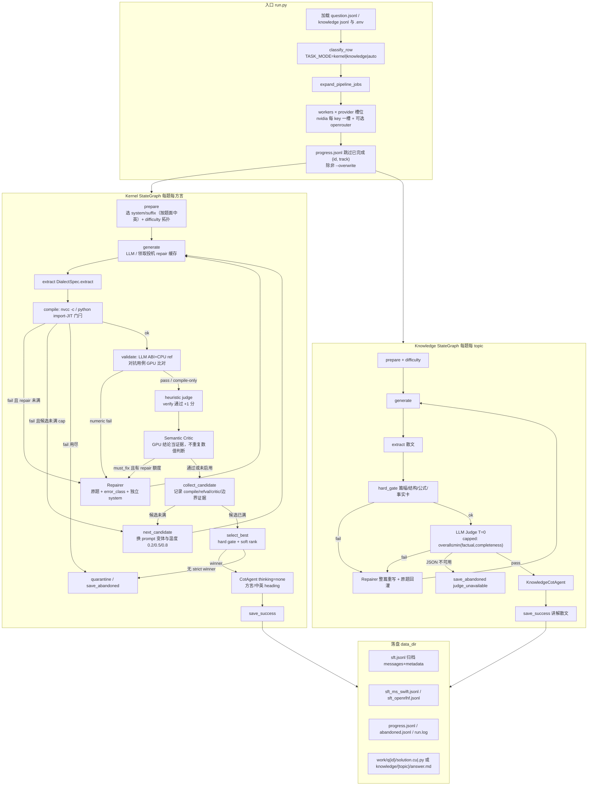
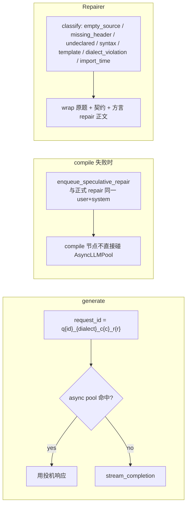

# CUDA 算子 SFT 数据生成

用配置的 NVIDIA/OpenRouter 大模型，为 `question.jsonl` 生成可 `nvcc -c` 编译的 CUDA 算子代码，写出 SFT jsonl。流程用 LangGraph 描述：生成 → 编译/数值验证 → 失败则按难度修正（simple/medium/hard 为 1/2/3 次）→ 候选池收集（2/3/4 个）→ strict gate 后择优保存。

判定分三段：`nvcc -c` / import-JIT 编译门闩 → CPU reference 随机/对抗数值验证（`refval`）→ heuristic judge + 可选 semantic critic。题面宣称的 `include/solution_header.h` 在本仓库不存在，编译用空 stub，所以每个 kernel 的 host ABI 都是模型自己发明的——验证是「LLM 抽取 ABI + 生成参考实现 → 确定性 runner 执行 → 数值比对」，没有写死的 C++ harness 签名。

## 准备

使用 conda 环境 `langchain`（其中已安装 langgraph；本机没有名为 `langgraph` 的 env）。

```bash
conda activate langchain
cp .env.example .env   # 若还没有 .env

# 检测四种内核方言环境，缺什么就自动安装
bash scripts/setup_env.sh
# 只检测，不安装、不改 .env
bash scripts/setup_env.sh --check
# 只准备其中几种
bash scripts/setup_env.sh --dialects cuda,cutlass,triton
```

等价入口：`python scripts/setup_env.py`、`python run.py --setup`。

脚本会按需：

1. `pip install -r requirements.txt`（核心 Python 依赖缺失时）
2. `pip install triton`（缺 torch 时一并装）和 `tilelang`
3. 没有 CUTLASS 4.x 时 `git clone` 到 `third_party/cutlass`，并写入 `CUTLASS_HOME`
4. 没有 `nvcc` 时尝试 conda（`nvidia` 频道的 `cuda-nvcc`）或 pip `cuda-toolkit` / NVIDIA wheels
5. 没有 `g++` 时尝试 conda-forge `cxx-compiler`
6. 对各方言做一次 smoke compile（可用 `--no-smoke` 跳过）

TileLang 使用 `tilelang==0.1.14`（可兼容的较新版本也可），检查会同时验证
`apache-tvm-ffi`、`torch-c-dlpack-ext`、`z3-solver` 等传递依赖、Torch CUDA 设备，
并实际把 canonical `T.prim_func` lowering 到 CUDA。仅能 import 包不算通过；依赖、GPU
或 lowering 不可用时会标记 `unavailable`，严格发布流程将样本留在 quarantine，不伪造 pass。

**不会**自动安装 GPU 驱动；没有 `nvidia-smi` 时 Triton JIT 可能不可用。conda/pip 装不上 `nvcc` 时请自行安装 CUDA Toolkit。

在 `.env` 填入对应 provider 的 key。可改的项：

| 变量 | 默认 | 含义 |
|---|---|---|
| `LLM_PROVIDER` | `openrouter` | `openrouter`（Anthropic Messages）或 `nvidia`（官方 OpenAI 兼容接口） |
| `OPENROUTER_API_KEY` / `OPENROUTER_BASE_URL` | OpenRouter | `LLM_PROVIDER=openrouter` 时使用 |
| `NVIDIA_API_KEY` / `_2` / `_3` / `NVIDIA_BASE_URL` | NIM | 最多 3 个 NVIDIA key（也可在 `NVIDIA_API_KEY` 里逗号分隔）；每个 key 独立占一个 nvidia 槽位。默认 `https://integrate.api.nvidia.com/v1` |
| `OPENROUTER_MODEL` | `nvidia/nemotron-3-ultra-550b-a55b:free` | OpenRouter 模型 |
| `NVIDIA_MODEL` | `nvidia/nemotron-3-ultra-550b-a55b` | NVIDIA 官方模型 |
| `MODEL` | 空 | 非空时覆盖上面两个，一般留空 |
| `THINKING_LEVEL` | `medium` | OpenRouter 走 `reasoning.effort`；NVIDIA 走 `chat_template_kwargs.enable_thinking` |
| `MAX_INPUT_TOKENS` | `131072` | 输入上下文上限（超出则丢掉旧轮、截尾；约按字符估算 token） |
| `MAX_OUTPUT_TOKENS` | `50000` | 输出 token 上限，对应 API 的 `max_tokens` |
| `MAX_TOKENS` | `50000` | 兼容别名；若未设 `MAX_OUTPUT_TOKENS` 则用它 |
| `TOP_P` | `0.95` | NVIDIA Chat Completions 的 top_p |
| `MAX_CANDIDATES` | `3` | 每题最多候选数；`DIFFICULTY_AWARE` 可能按题目难度收紧 candidate pool |
| `MAX_REPAIRS` | `3` | 每个候选最多修正次数 |
| `WORKERS` | `1` | `WORKERS_PER_PROVIDER=0` 时的总进程数；nvidia worker 在多个 key 间轮询 |
| `JUDGE_ENABLED` | `true` | 启用启发式代码质量评估（不过编译门闩） |
| `USE_JUDGE_OPTIMIZATION` | `false` | 预留：启发式 judge 当前不改写源码 |
| `KERNEL_LLM_CRITIC` | `adaptive` | `off` / `adaptive` / `always`。adaptive：启发式分 < 8 或有 issues 才打语义 critic |
| `KERNEL_CRITIC_BLOCKS_SAVE` | `false` | true 时 critic must_fix 可放弃该候选；默认只再修一轮仍保存已编译样本 |
| `DIFFICULTY_AWARE` | `true` | 简单题最多 1 候选且跳过 critic；难题用满候选 |
| `SFT_USER_IS_RAW_QUESTION` | `true` | 训练 jsonl 的 user 用原题，生成协议后缀只进 metadata |
| `KNOWLEDGE_JUDGE_MODE` | `capped` | `single` 原加权；`capped` 令 overall ≤ min(factual, completeness)；`split` 预留 |
| `COT_ENABLED` | `true` | 采集 API reasoning/thinking，并走 CoT 节点 |
| `COT_AGENT_ENABLED` | `true` | 用 CoT Agent 把原始 thinking 整理成教学型 CoT（额外一次 LLM 调用） |
| `COT_IN_ASSISTANT` | `true` | 训练标签是否包 `<think>…</think>` + 源码 |
| `COT_TEMPERATURE` | `0.2` | CoT Agent 采样温度 |
| `COT_MAX_CHARS` | `8000` | 整理后 CoT 字符上限 |
| `COT_RAW_MAX_CHARS` | `24000` | 送进 Agent 的原始 thinking 上限 |
| `COT_RAW_STORE_MAX_CHARS` | `32768` | `sft.jsonl` metadata 里归档 raw thinking 的上限 |
| `COT_ON_EMPTY` | `synthetic` | 教师 thinking 为空时：`synthetic`（由终稿代码反写）/ `empty` |
| `COT_ON_AGENT_FAIL` | `raw` | Agent 失败回退：`raw` / `synthetic` / `empty` |
| `TASK_MODE` | `kernel` | `kernel` 写算子（默认）；`knowledge` 原理/公式/CuTe 理论；`auto` 按行内 `task` 分流 |
| `KERNEL_DIALECTS` | `cuda` | 逗号分隔：`cuda`,`cutlass`（CUTLASS **4.x** + CuTe，别名 `cute`）,`triton`,`tilelang` |
| `KERNEL_MODE` | `single` | `single` 只跑一种；`all` 每题把列出的方言各生成一遍 |
| `KERNEL_DIALECT` | 空 | `single` 时覆盖列表第一项 |
| `CUTLASS_HOME` | `/usr/local/cutlass-4.3.5` | CUTLASS 4.x 根目录；`available()` 要求 `CUTLASS_MAJOR==4` |
| `CUTLASS_CXX_STD` | `c++17` | cutlass 方言 `nvcc -std=` |
| `TRITON_TIMEOUT_SEC` | `90` | Triton import/JIT 门闩超时 |
| `TILELANG_TIMEOUT_SEC` | `180` | TileLang 门闩超时；未安装则自动跳过 |
| `ASYNC_LLM_ENABLED` | `true` | 启用异步 LLM 调用（编译期间预生成修复轮响应） |
| `ASYNC_LLM_MAX_WORKERS` | `2` | 异步 LLM 并发数（1-4） |
| `LLM_PROVIDERS` | 空 | 逗号分隔多 provider，如 `nvidia,openrouter` |
| `WORKERS_PER_PROVIDER` | `0` | 每个槽位的并发数；NVIDIA 每个 key 各算一个槽位。例如 3 个 NVIDIA key + openrouter、值为 2 → 6 个 nvidia + 2 个 openrouter |
| `REPAIR_ERROR_MAX_CHARS` | `6000` | 修复轮 nvcc 日志上限；超过则去重摘要，不超过则全文 |
| `WORK_KEEP` | `simple` | `simple`：每题 `work/q{id}/` 只留最后一份 `solution.cu`；`detailed`：保留全部 `c*/r*` 尝试 |
| `REFVAL_ENABLED` | `true` | 编译通过后跑 CPU reference + GPU 数值比对；缺 nvcc/torch 则 skip，不阻塞保存 |
| `REFVAL_TIMEOUT_SEC` | `45` | 单题验证硬限（含 GPU 锁等待）；超时走 repair |
| `REFVAL_CASES` | `standard` | `smoke` / `standard` / `full` 对抗用例套件 |
| `REFVAL_STRICT` | `true` | 严格训练发布要求 refval `pass`；设为 `false` 才允许 compile-only 探索 |
| `REFVAL_MAX_ELEMENTS` | `4000000` | 大尺寸用例元素上限（3060 上毫秒级） |
| `REFVAL_CACHE` | `true` | 按 question+code 缓存 ABI/reference 抽取 |
| `CUDA_ARCH` | 空则自动探测 | 如 `sm_86` |
| `GPU_NAME` | 空则自动探测 | 写入 prompt |

NVIDIA 官方示例对应配置：

```
LLM_PROVIDER=nvidia
NVIDIA_BASE_URL=https://integrate.api.nvidia.com/v1
NVIDIA_API_KEY=nvapi-...
NVIDIA_API_KEY_2=nvapi-...
NVIDIA_API_KEY_3=nvapi-...
MODEL=nvidia/nemotron-3-ultra-550b-a55b
THINKING_LEVEL=medium
```

三个 NVIDIA key 用来提高 NIM 并发（额度按 key 独立计算）。配合 `LLM_PROVIDERS=nvidia,openrouter` 和 `WORKERS_PER_PROVIDER=1` 时，会启动 3 个 nvidia worker（每 key 一个）+ 1 个 openrouter worker。日志里只打印 `nvidia#1` / `nvidia#2` / `nvidia#3`，不会写出 key 本身。

本机默认会探测到 RTX 3060 / `sm_86` / CUDA 12.6。

## 运行

先确认本机 nvcc 可用：

```bash
conda activate langchain
python run.py --dry-compile
```

试跑 3 题：

```bash
python run.py --limit 3
```

全量（自动跳过 `data/progress.jsonl` 里已成功或已放弃的题）：

```bash
python run.py
```

也可不手动 activate，直接：

```bash
conda run -n langchain python run.py --limit 3
```

多进程（`.env` 里 `WORKERS`，或命令行覆盖）。jsonl 写入带文件锁；worker>1 时关闭 token 流式打印：

```bash
python run.py --workers 6 --quiet
python run.py --workers 6 --limit 12 --quiet   # 并发试跑
```

常用参数：`--offset N`、`--ids 1,2,10`、`--overwrite`、`--quiet`、`--workers N`、`--data-dir DIR`、`--dialects cuda,cutlass,triton`、`--kernel-mode all`。

只写 CUTLASS 4.x / CuTe：

```bash
python run.py --dialects cutlass --limit 3
```

每题同时写 CUDA + CUTLASS 4 + Triton + TileLang（TileLang 工具链 unavailable 时会记录证据并跳过）：

```bash
python run.py --dialects cuda,cutlass,triton --kernel-mode all --limit 3
```

### 只做 compile-only 门闩

默认 kernel 流程先执行 `nvcc -c`（或 Triton/TileLang 的 import-JIT 门闩），通过后才进入 `refval`。如果只想验证编译而不调用 reference runner，可关闭数值验证：

```bash
REFVAL_ENABLED=false REFVAL_STRICT=false python run.py --limit 3
```

`REFVAL_STRICT=true` 会把 ABI/reference 抽取错误、缺少工具链和数值验证 skip 都当作未发布样本：它们进入 quarantine/abandoned 记录，不会写入主 `sft.jsonl`。只有显式设为 `false` 才允许 compile-only 探索；此时 `metadata.refval.status` 仍会保留 `skip` 或 `reference_error`。`MAX_CANDIDATES` 是每题 candidate pool 的上限，`DIFFICULTY_AWARE=true` 会按 simple/medium/hard 使用 2/3/4 个候选。

### 真实 provider live smoke

真实 API 评测是独立、显式的命令，导入脚本或运行普通 pytest 不会发起调用。它读取当前 `.env` 的 `LLM_PROVIDER` 与 key，默认固定取 `question.jsonl` 前 10 题、每题最多 2 个候选、最多 20 次调用；输出只包含计数、响应长度、编译状态和脱敏错误类别：

```bash
python scripts/live_agent_eval.py --report data/live_agent_eval.json
```

先做最小连通性检查（1 题、1 次调用）：

```bash
python scripts/live_agent_eval.py --smoke --skip-compile
```

完整组件 smoke（仍受 `--max-calls` 硬上限约束）可调用 repair、semantic critic 与 CoT Agent；固定矩阵会把没有独立 oracle 的 refval 标为 `not_evaluated`，不会伪造通过：

```bash
python scripts/live_agent_eval.py --full --candidate-pool 1 --max-calls 20 --report data/live_agent_eval.json
```

真正的 GPU 数值验证仍由 `run.py` 的 refval runner 完成；live 脚本只在显式传入独立 manifest 时运行 refval。

`--strict` 会在生成错误或 compile-only 失败时返回非零；`--skip-compile` 只统计 API 生成。不要把 `.env` 或 API 响应提交到仓库；可提交的评测摘要路径是 `data/live_agent_eval.json`（由 `--report` 显式写入）。

### 跨方言 GPU 数值 Oracle

跨方言验证使用同一 semantic contract、reference 和 `cases_hash`，分别在 CUDA、CUTLASS、Triton、TileLang 后端真实执行。它不会把 import/JIT 通过当作数值正确，也不会把缺少后端当作 pass：缺失或 lowering 失败会记录为 `unavailable`/quarantine。

当前 canonical benchmark 支持 `elementwise_add`、`scale`、`row_sum`，并包含 good implementation 与 deliberate mutation（错误公式）对照。连续 tensor 的 smoke suite 已在本机 RTX 3060 上真实运行 CUDA、CUTLASS、Triton、TileLang；strided/broadcast 仍按 contract 的适用性单独计数：

```bash
python scripts/setup_env.py --check --dialects cuda,cutlass,triton,tilelang --no-smoke
PYTHONPATH=src python scripts/cross_dialect_oracle.py \
  --tasks elementwise_add \
  --dialects cuda,cutlass,triton,tilelang \
  --cases smoke --mutants \
  --report data/cross_dialect_oracle.json
```

真实 RTX 3060 smoke 结果应满足：CUDA/CUTLASS/Triton/TileLang 的 add 正例通过，错误 mutation 被判定为 `numeric_mismatch`；每个后端共享同一 good `cases_hash`。TileLang 需要真实 CUDA lowering、launch 和 `torch.cuda.synchronize()`，仅安装包或源码 marker 不算验证通过。

## 输出

| 文件 | 内容 |
|---|---|
| `data/sft.jsonl` | 生成归档（`messages` + `id`/`metadata`；包含 `task_spec`、`oracle_spec`、`quality_status`、候选池和 refval evidence；`metadata.raw_reasoning` 为原始 thinking，`metadata.cot` 为整理结果） |
| `data/sft_ms_swift.jsonl` | **ms-swift SFT** 标准 `messages` 格式 |
| `data/sft_openrlhf.jsonl` | **OpenRLHF SFT** 的 `input`/`output` 对话格式 |
| `data/abandoned.jsonl` | 按难度候选池耗尽、strict refval 未通过或 agent 验证失败的题目与证据 |
| `data/progress.jsonl` | 断点续跑 |
| `data/run.log` | 当次运行日志（已有内容则追加 session 横幅，不覆盖历史编译诊断；多进程共用） |
| `data/live_agent_eval.json` | 可选的 live-agent 脱敏统计（仅在 `scripts/live_agent_eval.py --report ...` 时写入） |
| `work/` | kernel：`solution.cu` 或 `solution.py`；knowledge：`knowledge/{topic}/answer.md`。`simple` 只留最后一份，`detailed` 保留 `c*/r*` |

默认 SFT assistant 是「整理后的 CoT + 抽取后的 CUDA 源码」：

```
<think>
1. Problem restatement
...
</think>
#include <cuda_runtime.h>
...
```

原始 API thinking 写在 `sft.jsonl` 的 `metadata.raw_reasoning`，不进 ms-swift / OpenRLHF。`COT_IN_ASSISTANT=false` 时训练 jsonl 仍为纯代码。已有 `sft.jsonl` 时可以只做格式导出（不调 API）：

```bash
python run.py --export-sft
```

### ms-swift

每行只有 `messages`（可选 system + user + assistant）：

```json
{"messages": [{"role": "system", "content": "..."}, {"role": "user", "content": "..."}, {"role": "assistant", "content": "..."}]}
```

```bash
swift sft \
  --model <your-model> \
  --dataset data/sft_ms_swift.jsonl \
  --tuner_type lora \
  --output_dir output/cuda-sft-swift
```

### OpenRLHF

`input` 是 prompt 侧 messages（system+user），`output` 是 assistant 目标：

```json
{"input": [{"role": "system", "content": "..."}, {"role": "user", "content": "..."}], "output": [{"role": "assistant", "content": "..."}]}
```

```bash
deepspeed --module openrlhf.cli.train_sft \
  --dataset data/sft_openrlhf.jsonl \
  --input_key input \
  --output_key output \
  --apply_chat_template \
  --pretrain <your-model> \
  --save_path ./checkpoint/cuda-sft-openrlhf
```

## 图结构

一句话摘要（kernel）：

```
prepare → generate → extract → compile
                         ├ compile ok → validate (ABI+CPU ref+GPU compare)
                         │                 ├ pass/skip/reference_error → heuristic judge (+1 if pass) → critic? → cot → save
                         │                 └ fail → repair / next_candidate / abandon（与编译失败同一梯子）
                         ├ repair < N → Repairer（题面回灌 + error_class + 压缩证据）→ generate
                         ├ candidate < cap → next_candidate → generate
                         └ else → save_abandoned
```

`extract` 期间用现有 `enqueue_speculative_repair` 异步池预取 ABI/reference（request id `q{id}_{dialect}_c{c}_r{r}_refval`），validate 命中则 0 额外等待。`WORKERS>1` 时 GPU 跑 harness 走 `work/.refval_gpu.lock`。产物：`work/q{id}/{dialect}/test/{harness.cu,manifest.json,cases.jsonl,refval.log}`；`metadata.refval` 写入 `data/sft.jsonl`。

离线批量（现有 kernel，真跑 GPU）：

```bash
python run.py --refval-offline --refval-limit 20
# 或
python -m cuda_sft.refval --limit 20
```

计时 A/B：同一批题 `REFVAL_ENABLED=false` vs `true`，增量目标 +20%、上限 50%。固定 10 题：`python scripts/benchmark.py --run-id refval_v1 --pipeline cuda`。

`KERNEL_MODE=all` 时在 CLI 层按方言展开 job（每题每种语言各跑一张 kernel 图），进度键是 `(id, dialect)`。知识题进度键是 `(id, knowledge:{topic})`，不会被方言展开。CUTLASS 方言钉 **CUTLASS 4.x + CuTe**。

固定 10 题回归：`python scripts/benchmark.py --module <name> --run-id <id> --pipeline cuda --pipeline knowledge`（kernel ID `1,5,8,20,26,27,38,42,75,90`，knowledge `1–10`）。

### 总览：从 jsonl 到 SFT



### Kernel 节点细节



投机 repair 在 `nvcc` 期间预拉下一轮 LLM，generate 命中则省 10–30s。`DIFFICULTY_AWARE=true` 时简单 elementwise 题 `candidate_cap=1` 且跳过 critic。

训练 jsonl 默认 **user = 原题**（`SFT_USER_IS_RAW_QUESTION`）；生成协议后缀（`nvcc -c`、fence 契约）写在 `metadata.generation_user_prompt`，避免学生模型学会数据管线口令。

### Knowledge 门闩细节

硬门闩（无 LLM）：最短篇幅、标题结构、formula 题要有公式、推导题要有步骤、事实卡（NVIDIA warp=32、block 线程上限 1024）。

LLM Judge 默认 `capped`：加权 overall 不得超过 factual 与 completeness 的最小值，must_fix 一票否决。JSON 解析失败记 `judge_unavailable` 并放弃该题（不把坏 JSON 当及格）。

`python -m cuda_sft` 与 `run.py` 等价（后者会先确保 `src/` 在 `sys.path`）。

## 知识题（架构 / CuTe 理论 / 公式）

写算子题走编译门闩；CUDA 底层原理、NVIDIA 架构、CuTe layout、公式推导走**独立** knowledge 流水线，不进 `DialectSpec`，也不跑 `nvcc`。默认 `TASK_MODE=kernel`，现有 `question.jsonl` 行为不变。

知识题 jsonl 由你提供（本仓库不生成题目，只答题）。每行至少要有 `question`，建议带 `task` / `topic`：

```bash
python run.py --task knowledge --input /path/to/knowledge.jsonl --data-dir data/knowledge
python run.py --task auto --input /path/to/mixed.jsonl
```

| 变量 | 默认 | 含义 |
|---|---|---|
| `TASK_MODE` / `--task` | `kernel` | `kernel` 强制整文件当代码题；`knowledge` 强制知识题；`auto` 看行内 `task` 字段，否则启发式（冲突判 kernel） |
| `KNOWLEDGE_MIN_SCORE` | `7` | LLM Judge 加权分阈值 |
| `KNOWLEDGE_JUDGE_MODE` | `capped` | overall 不得超过 factual 与 completeness 的最小值 |
| `KNOWLEDGE_MAX_CANDIDATES` / `KNOWLEDGE_MAX_REPAIRS` | `2` / `2` | 知识题候选与返修次数（再被 difficulty cap 收紧） |

jsonl 可带显式字段（可选）：

```json
{"question": "Explain CUDA occupancy.", "task": "knowledge", "topic": "formula"}
```

`topic`：`architecture` `memory` `execution` `formula` `cute` `cutlass` `isa` `api` `general`。这里的 `cute` 是 **CuTe 理论讲解**，与 `KERNEL_DIALECTS=cute`（CUTLASS 4 写代码）不是同一条路径。知识题进度键是 `(id, knowledge:{topic})`，不会被方言展开。

知识题判定：硬门闩（篇幅、结构、公式、不变量事实卡）+ 可选 LLM JSON Judge（factual / completeness / derivation / terminology / structure / grounding）。过线后再走独立 CoT Agent。assistant 是讲解散文，不是 `solution.cu`。

LLM：`LLM_PROVIDER=openrouter` 时走 Anthropic Messages（`POST {OPENROUTER_BASE_URL}/v1/messages`）；`nvidia` 时走 OpenAI Chat Completions 流式（`{NVIDIA_BASE_URL}/chat/completions`）。生成时采集 reasoning/thinking（OpenRouter：`thinking` block / `reasoning` 字段；NVIDIA：`delta.reasoning_content`，必要时再从 `<think>` 标签兜底）。`judge` 与 `cot` 在开关关闭时 no-op。CoT Agent 只整理胜出样本的推理，不改已经通过编译的代码。高质量 CoT 建议保持 `THINKING_LEVEL=medium` 或 `high`，并让 `MAX_OUTPUT_TOKENS` 明显大于思考预算。
